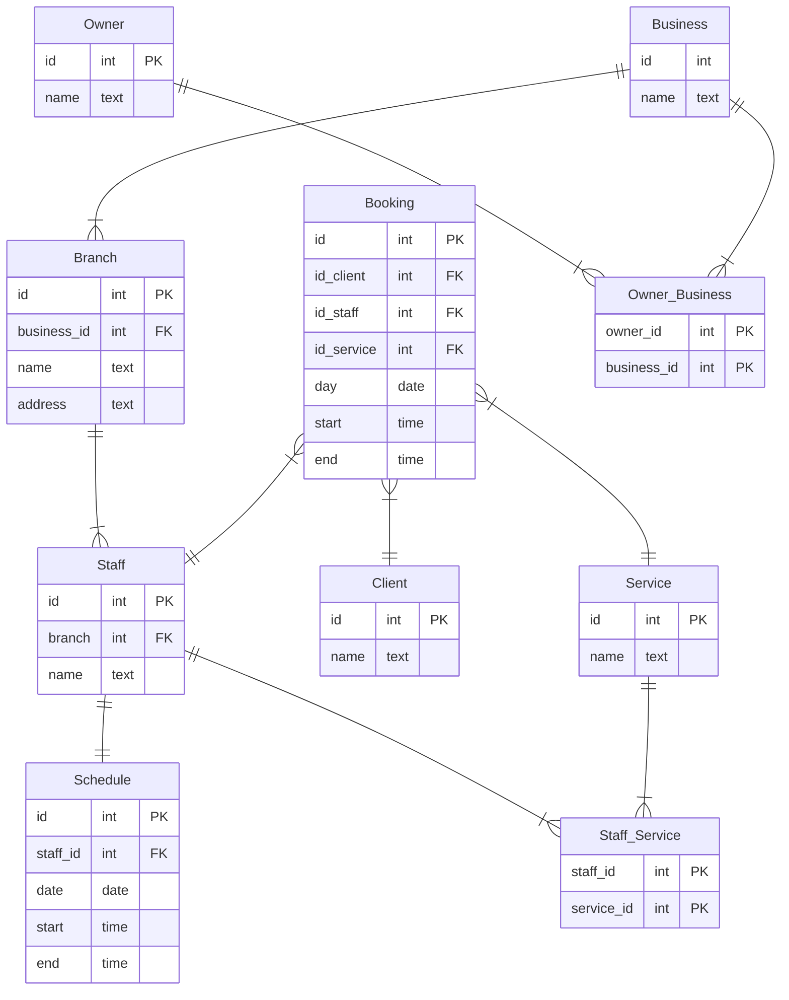

# Booking App
Backend to build a booking application for a hair salon

# Entity Relation Model

```mermaid
erDiagram

Owner{
    id int PK
    name text
}

Staff{
    id int PK
    branch int FK
    name text 
}

Client{
    id int PK
    name text
}

Business{
    id int
    name text
}

Branch{
    id int PK
    business_id int FK
    name text
    address text
}

Service{
    id int PK
    name text

}

Schedule{
    id int PK
    staff_id int FK
    date date
    start time
    end time
}

Booking{
    id int PK
    id_client int FK
    id_staff int FK
    id_service int FK
    day date
    start time
    end time
}

Owner_Business{
    owner_id int PK
    business_id int PK
}

Staff_Service{
    staff_id int PK
    service_id int PK
}

%% Message{
%% }

%% Log{
%% }

%% Notification{
%% }

Owner ||--|{ Owner_Business : ""
Business ||--|{ Owner_Business : ""
Business ||--|{ Branch : ""
Branch ||--|{ Staff : ""
Staff ||--|| Schedule : ""
Staff ||--|{ Staff_Service : ""
Service ||--|{ Staff_Service : ""
Booking }|--|| Client : ""
Booking }|--|| Staff : ""
Booking }|--|| Service : ""
```

